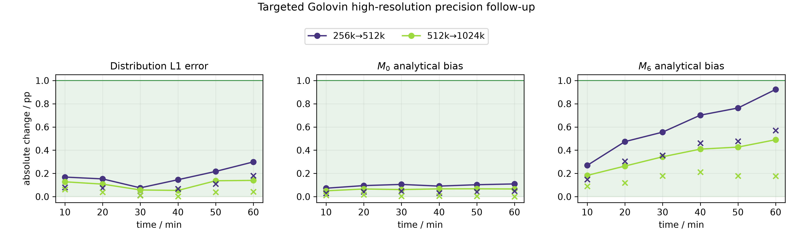
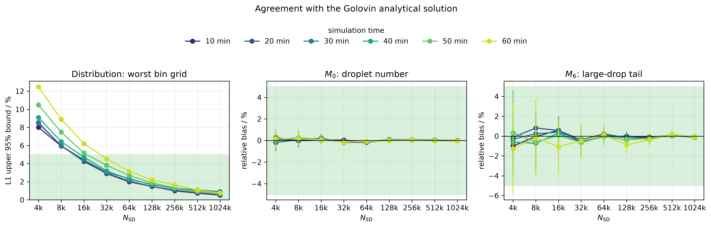
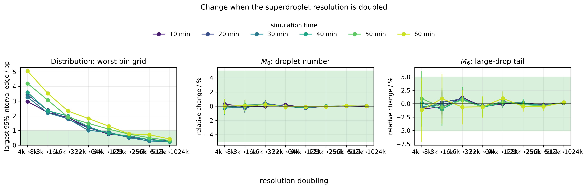
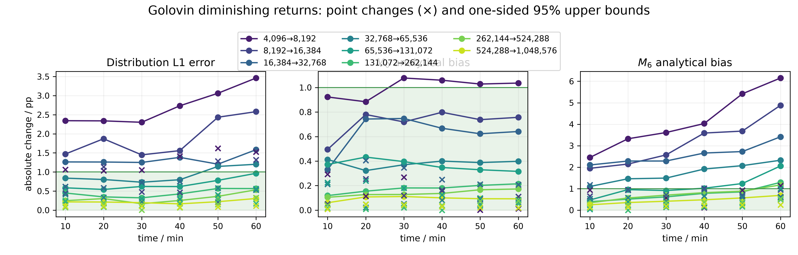
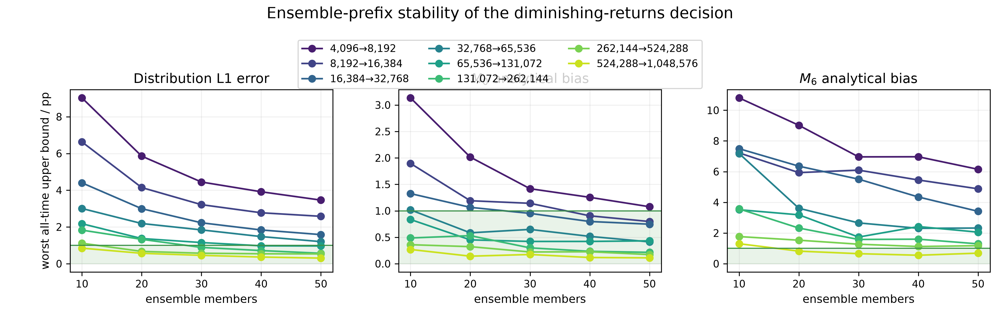
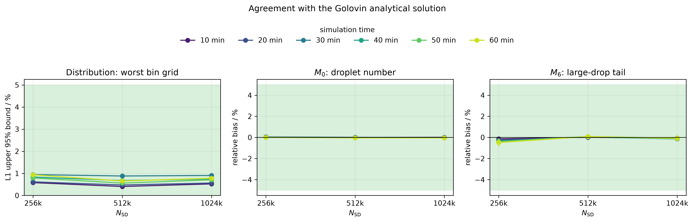
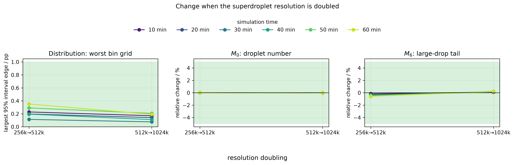
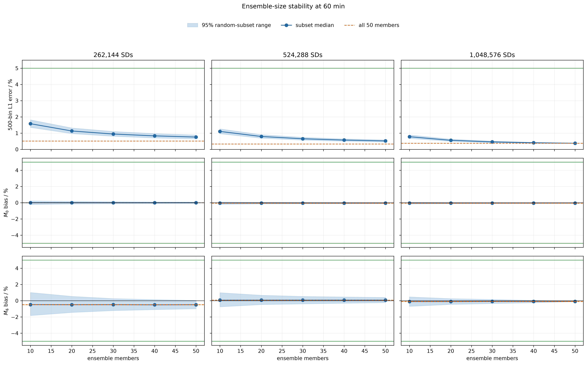

# Controlled 0-D Golovin convergence calibration — complete result record

**Status:** completed, checksum-audited numerical calibration
**Final analysis:** 2 August 2026
**Model:** CLEO collisions0d; upstream CLEO commit 83318c23223546d10759d202d70f4fa2f7fe4688
**Scope:** collision–coalescence only. This is not a Long-kernel, cloud, precipitation, 1-D, or 2-D result.

## 1. Executive result

This study asks a deliberately narrow numerical question: **for this controlled Golovin 0-D collision–coalescence box, how many superdroplets are needed before doubling the resolution no longer changes the chosen mean diagnostics by a scientifically material amount?**

There are two results, produced by two intentionally separate protocols.

| Evidence layer | Exact design | Result | Correct wording |
| --- | --- | --- | --- |
| Balanced fixed-50 resolution study | Nine resolutions, 4,096–1,048,576 SDs; 50 independent collision histories at every resolution | **131,072 SDs selected** by the originally registered formal \(N\), \(2N\), \(4N\) selection rule | “The balanced fixed-50 formal rule selected 131,072 SDs.” |
| Targeted high-resolution precision follow-up | 262,144: 150 members; 524,288: 150; 1,048,576: 50 | **262,144 SDs selected within the targeted practical follow-up** | “The separate high-resolution follow-up supports 262,144 SDs under the practical two-doubling criterion.” |

The second result **does not overwrite** the first. It was a prospectively fixed follow-up to reduce uncertainty in one limiting high-resolution comparison. Its result metadata sets formal_convergence_claim_permitted to false: it is a targeted practical conclusion, not a retroactive replacement for the balanced experiment.

In both analyses, the numerical solution is accurate relative to the Golovin analytical reference, liquid-water mass is conserved, and the diagnostic radius range is adequate. The final practical decision is limited by the large-drop-sensitive sixth moment, \(M_6\), not by a model failure.

## 2. Why Golovin comes first

The Golovin kernel is an idealised coalescence kernel for which a closed-form mean-field solution is available. It is therefore a calibration problem: it lets us test the full CLEO workflow—controlled initialisation, stochastic collision sampling, output, diagnostics, uncertainty estimates and stopping logic—against a reference before applying the workflow to the physically more complex Long kernel, which has no comparable closed-form population solution.

The model is a **0-D box** with one gridbox. Only collision–coalescence is enabled. Condensation/evaporation, motion, dynamical coupling, fallout and radiation are disabled. This isolates the stochastic collision algorithm.

> The conclusion is a Golovin calibration for this box volume, controlled initial population, 0.1-s collision timestep, 1–5000-µm diagnostic range, 600–3600-s decision times, selected metrics and error budget. It is not a universal SD count for a Long kernel or a cloud simulation.

## 3. Physical and numerical setup

### 3.1 Integration and outputs

| Item | Value | Meaning |
| --- | ---: | --- |
| Collision kernel | Golovin | Analytical validation case; not a hydrodynamic Long kernel. |
| Collision timestep | 0.1 s | Interval between stochastic collision updates; selected in a separate timestep screen. |
| End time | 3600 s (60 min) | A registered finite test horizon, not a universal physical stopping time. |
| Output cadence | 600 s | Decision times are 600, 1200, 1800, 2400, 3000 and 3600 s. |
| Model threads/member | 1 | Each member is one MPI rank and one Kokkos/OpenMP thread. |
| Primary distribution grid | 500 common logarithmic-radius bins | Same bin edges at every resolution, so an apparent improvement cannot come from changing smoothing. |
| Sensitivity grids | 250 and 1000 bins | Required robustness diagnostics; 500 bins is the prespecified primary estimand. |
| Diagnostic radius range | 1–5000 µm | Covers the evolved large-drop tail; not the same thing as the 1–75-µm initial support. |

### 3.2 Controlled, frozen initialisation

The starting droplet population is an exponential-in-volume distribution, conditioned to initial wet radii from 1 to 75 µm. For every tested resolution, a deterministic finite-support/log-volume construction generates one CLEO-native binary input. It controls the number concentration \(M_0\) and liquid-volume moment \(M_3\), uses integer multiplicities, and checks \(M_6\) rather than forcing it. The generated binary is then checksum verified and made read-only.

All collision members at one resolution read the same immutable initial binary. This is the meaning of a **frozen initialisation**. It prevents random differences in the initial particle sample from being confused with the stochasticity of collision–coalescence.

Each member nevertheless has its own recorded collision random-number seed. Thus the ensemble quantifies the variability due to stochastic collision histories, conditional on one fixed starting population. Different resolutions have independent ensembles: equal member numbers across two resolutions are reproducible labels, **not paired physical trajectories**.

The controlled 1–75-µm starting population is not mathematically identical to the untruncated analytical Golovin reference. An initial audit found a 0.00413% mass-distribution L1 mismatch and a \(2.97\times10^{-5}\) relative \(M_3\) difference. This is two to three orders of magnitude smaller than the late-time numerical distribution errors, but it means the comparison is best described as *practically equivalent*, not exact in the strict mathematical sense.

## 4. Quantities that were required to converge

### 4.1 Distributional error

At each output time, individual member mass-density distributions are first put on the same fixed log-radius grid and then averaged over the ensemble. The primary error is the relative L1 distance of that **ensemble-mean** distribution from the analytical distribution:

\[
\mathrm{L1}(t)=
\frac{\sum_b\left|\overline{g}_b(t)-g^{\mathrm{analytic}}_b(t)\right|}
     {\sum_b\left|g^{\mathrm{analytic}}_b(t)\right|}.
\]

Here \(b\) denotes a common log-radius bin and \(g\) is liquid-mass density per unit \(\ln r\). L1 is zero only for exact agreement on that grid. It answers a stronger question than a scalar moment because it detects where mass lies across the whole droplet-size distribution.

### 4.2 Moments and integrity diagnostics

| Quantity | What it measures | Why it is retained |
| --- | --- | --- |
| \(M_0\) | Droplet number concentration (m\(^{-3}\)) | Low-order bulk population quantity. |
| \(M_3\) | Radius-cubed moment, proportional to liquid-water mass | Conservation diagnostic: coalescence should redistribute liquid mass, not create or destroy it. |
| \(M_6\) | Radius-sixth moment (µm\(^6\) m\(^{-3}\)) | Strongly weights rare large droplets; a reflectivity-like tail diagnostic and the hardest quantity here. |
| Relative liquid-mass drift | Change of total represented liquid mass | Numerical integrity gate. |
| Out-of-range mass fraction | Liquid mass outside 1–5000 µm | Ensures the diagnostic grid is not silently discarding tail mass. |

The measured maximum relative liquid-mass drift in the final targeted analysis was \(1.155\times10^{-9}\), well below the \(10^{-7}\) gate. The out-of-range mass fraction was zero in the published diagnostics.

## 5. How “converged” was defined

No universal SDM convergence threshold exists in the literature; the required particle number depends on kernel, initialisation, algorithm, box, diagnostic, time and ensemble design. The criterion here was therefore made explicit before the relevant model data were generated.

### 5.1 Hard validity requirements

For a candidate \(N\), all of \(N\), \(2N\) and \(4N\) must pass at every registered decision time:

1. primary 500-bin L1 upper 95% confidence bound no larger than 5%;
2. \(M_0\) and \(M_6\) analytical-bias confidence intervals inside ±5%;
3. relative liquid-mass drift no larger than \(10^{-7}\);
4. out-of-range mass fraction no larger than \(10^{-6}\); and
5. complete frozen-input, seed, executable, configuration and output provenance checks.

These gates prevent a sequence that is flat but wrong from being called converged.

### 5.2 Practical diminishing-returns requirement

For each primary quantity \(q\in\{\mathrm{L1},M_0,M_6\}\), define the absolute change between independent resolution ensembles as

\[
D_q(N,t)=100\,|\widehat q(N,t)-\widehat q(2N,t)|
\quad\text{percentage points}.
\]

The **minimum worthwhile improvement** is 1 percentage point. This is an absolute tolerance: it is 20% of the 5% analytical-accuracy budget, and it has a direct scientific interpretation. A point estimate alone is not enough. The one-sided 95% percentile-bootstrap upper bound on \(D_q\) must be \(\leq1\) percentage point at every decision time, for both \(N\to2N\) and \(2N\to4N\). Two successive doublings guard against a one-step accidental plateau.

The previously considered “ratio of successive improvements” is explicitly excluded. For a normal power-law error it approaches a non-zero constant; with finite stochastic ensembles it is unstable when the previous improvement is small. It does not answer whether the remaining change is materially important.

### 5.3 Why this is scientifically defensible

The literature supports a layered rather than visual definition. Shima et al. (2009) used the Golovin case to show improving mean distributions with increasing SD count, but did not prescribe a universal fixed-bin confidence interval. Unterstrasser et al. (2017, 2020) show that initialisation and the number of effective realisations matter for apparent convergence. Morrison et al. (2024) treats small final changes as evidence of convergence only in the context of the diagnostic and preceding changes. Zmijewski et al. (2024) distinguishes convergence of a mean distribution from continuing reduction of stochastic variance. A literal visual plateau of the variance is not expected.

Accordingly, this project combines reference accuracy, conservation, a practical effect-size budget, uncertainty bounds and two doublings. It does not infer convergence merely because a curve “looks flat.”

## 6. Experiment sequence and data provenance

### 6.1 Balanced fixed-50 ladder

The primary balanced experiment contained nine factor-of-two resolutions:

\[
4096,\ 8192,\ 16384,\ 32768,\ 65536,\ 131072,\ 262144,\ 524288,\ 1048576
\]

with 50 fresh collision histories at each level: 450 model members in total. It used the 0.1-s collision timestep and full-state output at 0, 600, …, 3600 s. Original raw member output was preserved rather than overwritten.

The formal balanced selection requires the hard validity gates at \(N\), \(2N\), and \(4N\), and both adjacent equivalence comparisons to pass. It selected **131,072 SDs**. In the published decision record, the adjacent pairs 131,072–262,144, 262,144–524,288 and 524,288–1,048,576 pass the formal equivalence check. This statement refers to the fixed-50 formal protocol.

The separately defined practical rule at 50 members had no selected level: one late-time \(M_6\) bound for 262,144–524,288 was 1.174 percentage points, slightly above the 1-point margin. This was an uncertainty limitation, not a failed model result.

### 6.2 Targeted high-resolution precision follow-up

The follow-up was fixed before its new data were examined. It did not reuse any old collision seeds, run labels or raw output paths. It added 100 new collision streams (member indices 50–149) at only the two limiting levels:

| Resolution | Original fixed-50 members | Newly added | Final members used in targeted analysis |
| ---: | ---: | ---: | ---: |
| 262,144 | 50 | 100 | 150 |
| 524,288 | 50 | 100 | 150 |
| 1,048,576 | 50 | 0 | 50 |

The initial binary at each extended resolution was reused read-only, byte-for-byte. The 1,048,576-SD group remains the independent confirmation level for the second doubling. The combined view contains 350 high-resolution members and uses symlinks to raw source directories, so no raw Zarr data were duplicated.

### 6.3 Execution audit

The final clean model job was Levante job 26625529. It ran 200 new members on one mh0731/shared node using 20 physical CPU cores (hint=nomultithread), 8 GiB memory and one thread/member. It completed all 200 cases; the summed member wall time was 109.309 physical core-hours, the allocation elapsed time was 6 h 21 min 55 s, raw new Zarr output was 19.0 GB, and worker stderr was empty. The subsequent Stage-0/checksum job 26629617 passed all 200 diagnostics. The final analysis job 26630002 completed in 4 min 5 s and verified all 24 published output files by SHA-256.

Earlier failed allocations were retained only as operational audit history: they produced no admitted scientific data and were excluded from every result. The final dataset and code revisions are the only basis of the conclusions.

## 7. Final targeted result

At the primary 500-bin resolution, every required adjacent pair and time passes the practical 1-percentage-point upper-bound criterion. The limiting rows are below; they are the *largest* one-sided 95% upper bounds across 600–3600 s for each metric and pair.

| Pair | Quantity | Time of worst bound | Point change (pp) | One-sided 95% upper bound (pp) | Pass? |
| --- | --- | ---: | ---: | ---: | --- |
| 262,144 → 524,288 | L1 | 3600 s | 0.180058 | 0.299121 | yes |
| 262,144 → 524,288 | \(M_0\) | 3600 s | 0.047891 | 0.109501 | yes |
| 262,144 → 524,288 | \(M_6\) | 3600 s | 0.570009 | **0.923270** | yes |
| 524,288 → 1,048,576 | L1 | 3600 s | 0.042752 | 0.139872 | yes |
| 524,288 → 1,048,576 | \(M_0\) | 3000 s | 0.004262 | 0.067328 | yes |
| 524,288 → 1,048,576 | \(M_6\) | 3600 s | 0.177355 | 0.490249 | yes |

The late-time \(M_6\) change for 262,144 → 524,288 is the limiting result: its upper confidence bound is 0.923 percentage points, still below the predeclared 1-point limit. All three diagnostic grids (250, 500 and 1000 bins) select 262,144 SDs; sensitivity analysis therefore triggers no investigation.

The analytical and integrity gates also pass at 262,144, 524,288 and 1,048,576 SDs. At 262,144 SDs, the worst 500-bin analytical L1 estimate is 0.743883% (upper confidence bound 0.853184%) at 1800 s. All are well inside the 5% accuracy budget.

*Figure 1. Targeted follow-up. Filled circles are the one-sided 95% upper bounds on absolute independent-ensemble changes; crosses are point changes. The green region, from 0 to 1 percentage point, is the prespecified practical acceptance region. The late-time \(M_6\) upper bound is the closest result to the threshold, but remains inside it.*

## 8. Reading the figures

The archived figures below are publication-quality PNGs generated by the versioned project analysis. They use distinct colours for each resolution pair and do not hide uncertainty in prose.

### 8.1 Original balanced fixed-50 evidence

### 8.2 Targeted high-resolution supporting evidence

The **green shading** in accuracy/equivalence figures is an acceptance band, not a confidence interval. It marks values that are inside the relevant predeclared tolerance. In the targeted diminishing-returns figure, the green 0–1-pp strip is the acceptance region for the upper bound. A plotted point outside it would fail; a point inside it is acceptable only because the other validity and provenance gates also pass.

## 9. Reproducibility ledger

### 9.1 Primary result locations on Levante

| Artifact | Location |
| --- | --- |
| Balanced fixed-50 analysis | /home/m/m301324/SDM/CLEO-SDM-Convergence-records/golovin_fixed50_extended_resolution_convergence_v1/analysis_v2/ |
| Targeted final analysis | /home/m/m301324/SDM/CLEO-SDM-Convergence-records/golovin_fixed50_highres_precision_extension_v1/analysis_v1/ |
| Targeted combined read-only view | /home/m/m301324/SDM/CLEO-SDM-Convergence-records/golovin_fixed50_highres_precision_extension_v1/combined_analysis_view_v1/ |
| Targeted decision | analysis_v1/targeted_practical/targeted_precision_decision.json |
| Targeted primary numerical table | analysis_v1/targeted_practical/diminishing_returns.csv |
| Targeted validity table | analysis_v1/targeted_practical/analytical_validity.csv |

The targeted decision records the combined member-time checksum d87595b41c36bcd3e995ef5641258a8fb9419bd74d20b4277cbe763e759170c5, the combined matrix checksum 5898b6298882a89785ee7bb27b0c842654a31b82cf1d2095530fa87dee2b8f35, and the combined-analysis configuration checksum a3a4618cd4b5adddbdb63d3ccf1b8e5d0fd2ddbd94c9b5960e81d6c2d5246fab.

### 9.2 Analysis code and protocol

| Purpose | Repository file |
| --- | --- |
| Targeted extension definition | config/golovin_fixed50_highres_precision_extension.yaml |
| Read-only combined-analysis definition | config/golovin_fixed50_highres_precision_combined_analysis.yaml |
| Targeted extension runbook | docs/experiments/golovin-targeted-highres-precision-extension-runbook.md |
| Practical criterion decision record | docs/decisions/0007-proposed-diminishing-returns-convergence.md |
| Balanced fixed-50 protocol | docs/decisions/0009-fixed50-extended-golovin-design.md |
| Literature review underlying the design | docs/literature/golovin-convergence-extension-review.md |

The project branch holding the targeted-analysis correction is agent/golovin-highres-150-extension at commit 55a8cb5.

## 10. What we can say to Clara—and what we cannot say

### Supported statements

1. The collision-only CLEO Golovin workflow is numerically healthy under the stated controlled setup: analytical agreement, mass conservation, diagnostic-range coverage, frozen initial inputs, unique collision streams and output checks all pass.
2. In the original balanced 50-member ladder, the project's formal \(N\)/\(2N\)/\(4N\) selection rule selects 131,072 SDs.
3. In the separate prospective high-resolution follow-up, the practical two-doubling uncertainty rule supports 262,144 SDs. The closest limiting statistic is the 3600-s \(M_6\) bound, 0.923 pp versus a 1.0-pp threshold.
4. The conclusion rests on a documented effect-size and uncertainty rule, not visual curve flattening or a non-significant difference.

### Statements that would overreach

1. “262,144 SDs is the universal CLEO or SDM resolution requirement.”
2. “Golovin proves that the Long kernel is converged at the same resolution.”
3. “The model variance has converged.” The study targets the ensemble mean and selected mean diagnostics; stochastic spread is a distinct question.
4. “The analytical reference exactly equals the conditioned 1–75-µm initial state.” It is practically, not mathematically, identical at initialization.
5. “The later follow-up overwrote the original formal result.” It did not.

## 11. Literature cited

- Shima, S. et al. (2009), *The super-droplet method for the numerical simulation of clouds and precipitation: a particle-based and probabilistic microphysics model coupled with a non-hydrostatic model*, QJRMS. doi:10.1002/qj.441.
- Unterstrasser, S. et al. (2017), *Collection/aggregation algorithms in Lagrangian cloud microphysical models: rigorous evaluation*, GMD 10, 1521–1548. doi:10.5194/gmd-10-1521-2017.
- Unterstrasser, S. et al. (2020), *Collisional growth in a particle-based cloud microphysical model: insights from column model simulations using LCM1D*, GMD 13, 5119–5145. doi:10.5194/gmd-13-5119-2020.
- Morrison, H. et al. (2024), *Impacts of stochastic coalescence variability in a Lagrangian cloud microphysics model*, JAS. doi:10.1175/JAS-D-23-0132.1.
- Zmijewski, P. et al. (2024), *Modeling collision–coalescence in particle microphysics*, GMD 17, 759–789. doi:10.5194/gmd-17-759-2024.

## 12. Immediate research consequence

This is a finished Golovin calibration record. It supplies a defensible template for a **separately designed** Long-kernel study, but does not transfer the 131,072- or 262,144-SD count to Long. Before a Long convergence result is claimed, its own initial distribution, physical tail/precipitation metric, reference or comparator, resolution ladder, ensemble design and stopping rule must be fixed and documented.
